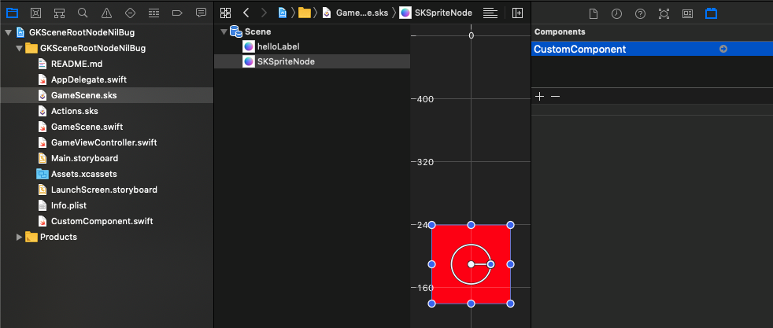
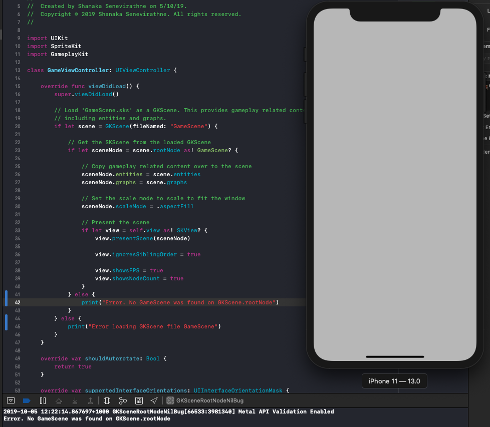

# Swift SpriteKit XCode scene editor + GKScene unexpected behaviour

## Reference
This project is created in reference to the following stackoverflow question
https://stackoverflow.com/questions/58245066/adding-a-custom-gkcomponent-to-an-entity-in-xcode-spritekit-scene-editor-sets-gk

## Problem statement
scene.rootNode is not assigned when SKScene is loading with GKScene when that SKScene has GKComponents added using xcode sprite kit scene editor

### Screenshot

Adding a custom component in xcode sprite kit scene editor

Results in not loading the SKScene properly when GKScene init is used. GKscene.rootNode is set to nil

