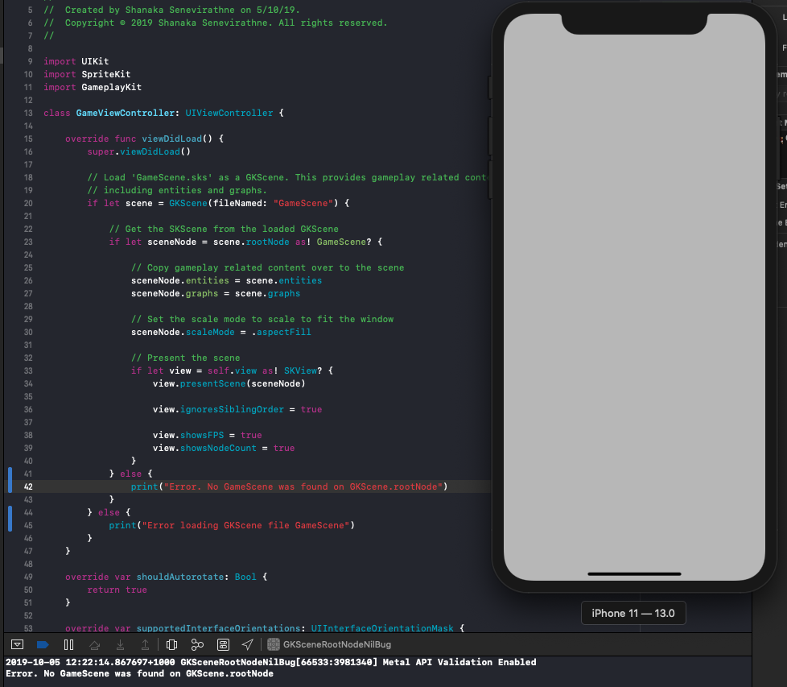

# Swift SpriteKit XCode scene editor + GKScene unexpected behaviour

## Problem statement
scene.rootNode is not assigned when SKScene is loading with GKScene when that SKScene has GKComponents added using xcode sprite kit scene editor

